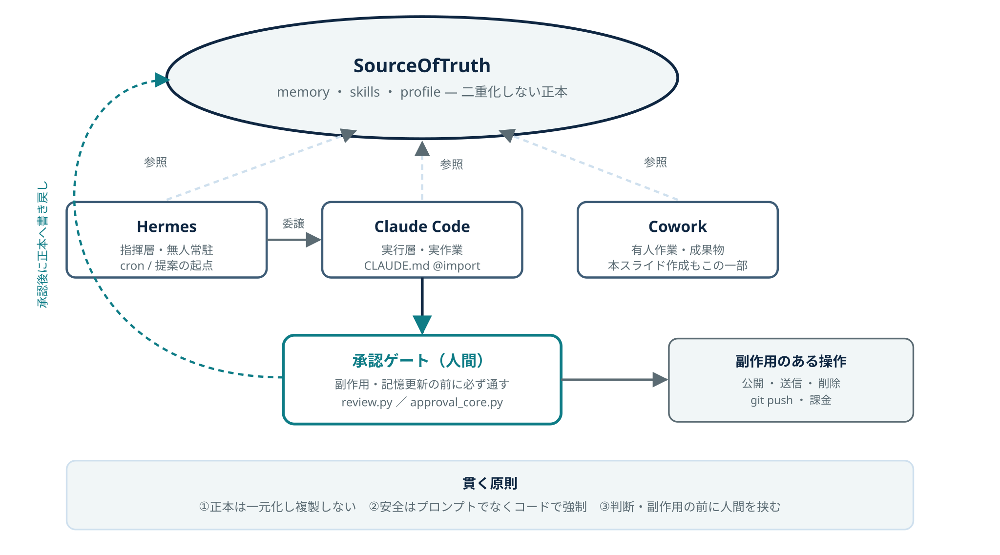

# Governed Memory Layer

複数のAIアシスタント（Claude Code / claude.ai / Hermes / Cowork）が同じ知識を参照して動くための、統一正本（memory・skills）と承認ループの設計。

アプリ開発ではなく、AIエージェント群を安全に運用するための**環境構築・整備**のプロジェクト。実装は各アシスタントの設定・スクリプト・cronに分散しているため単体では動かせないが、設計そのものが成果物。個人データは一切含まず、図とアーキテクチャ説明のみで構成している。

## 目標状態

- **SourceOfTruth を一元化**し、複製しない（memory・skills・profile）
- 各アシスタントは正本を「投影」して参照する（読み取り）
- 正本の更新は「点検 → 提案 → 承認」を通ってのみ発生する（書き込み）
- **安全はプロンプトではなくコードで強制**する。副作用のある操作（公開・送信・削除・push・課金）は必ず人間の承認ゲートを通す

詳細は [architecture.md](docs/architecture.md) を参照。

## 機能マップ

1. 記憶正本の投影 ／ スキル正本の投影
2. 記憶正本の最適化 ／ スキル正本の最適化
3. 大規模データ参照（RAG・MCPサーバー化）
4. メタデータ最適化（システム資産のメタデータ更新）
5. 定期情報収集
6. スケジュール更新（バックログ・チェックリストの定期更新）
7. ビジネスデータ定期更新（スライド・プロフィール・ポートフォリオ）

それぞれの設計は [architecture.md](docs/architecture.md) で章立てして解説している。
