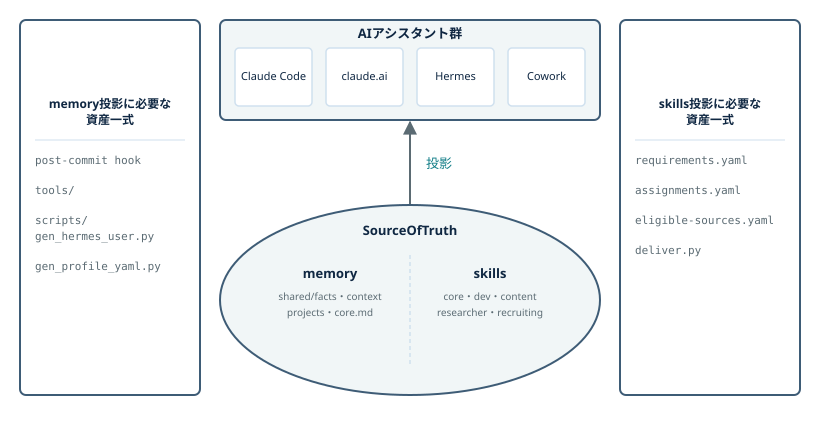
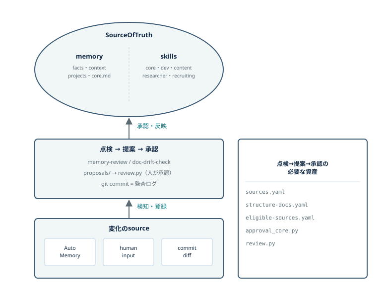
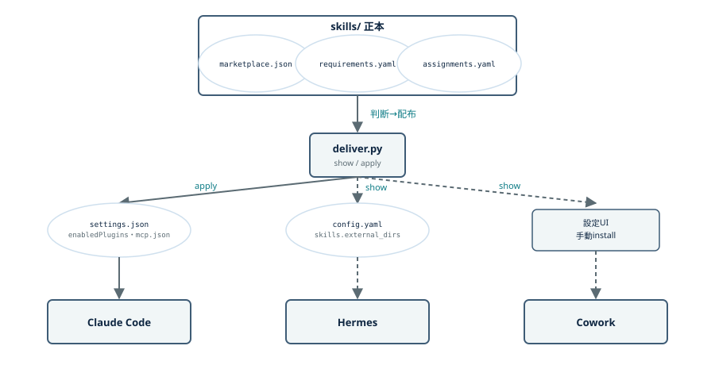
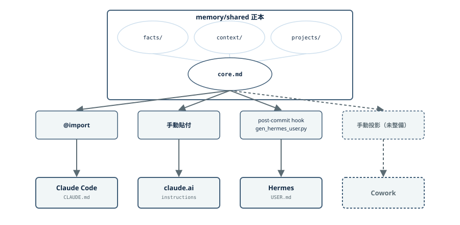
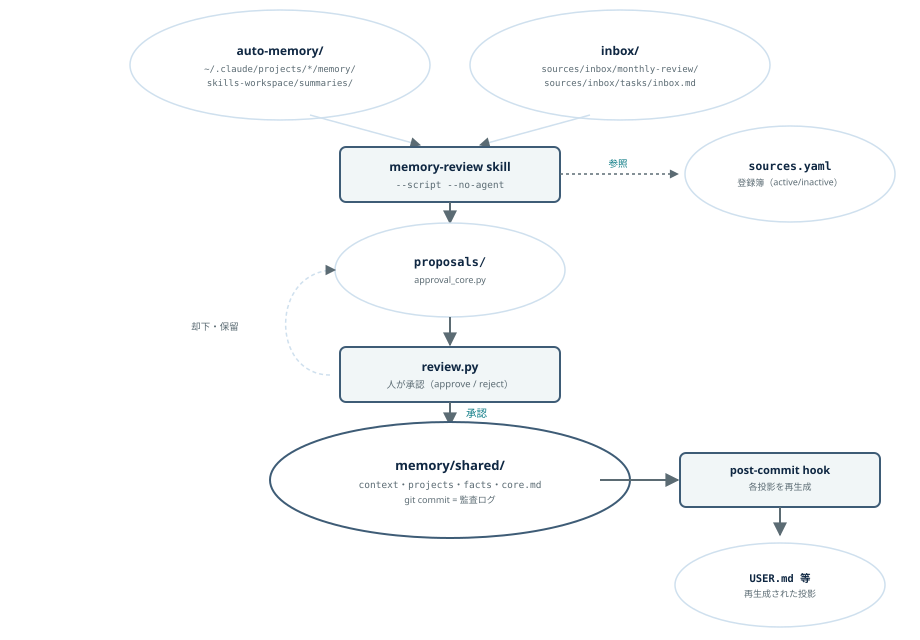
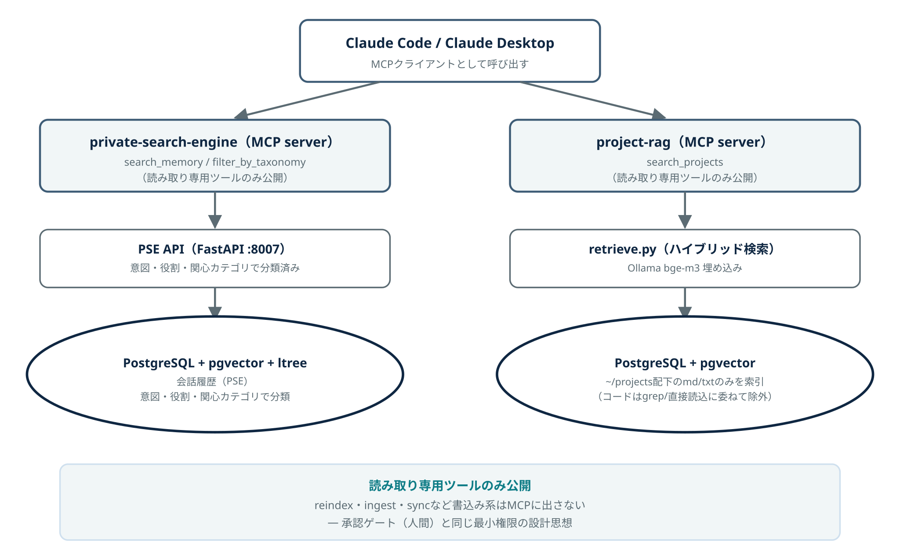
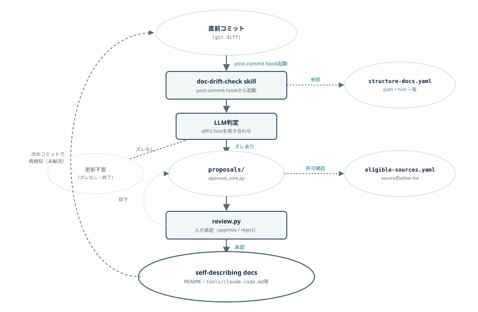
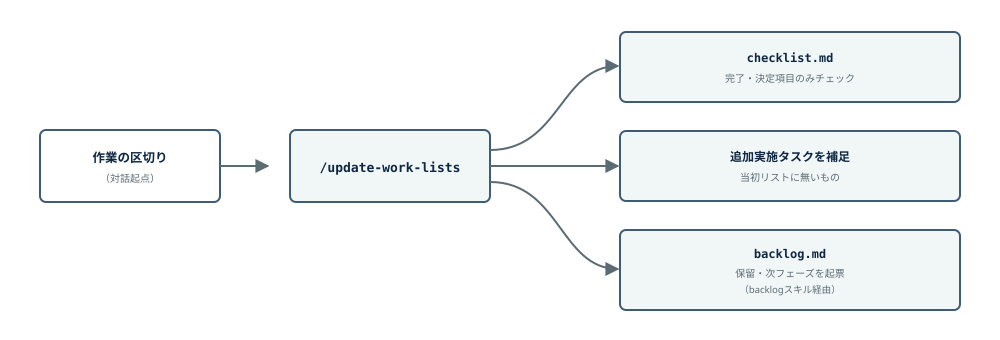
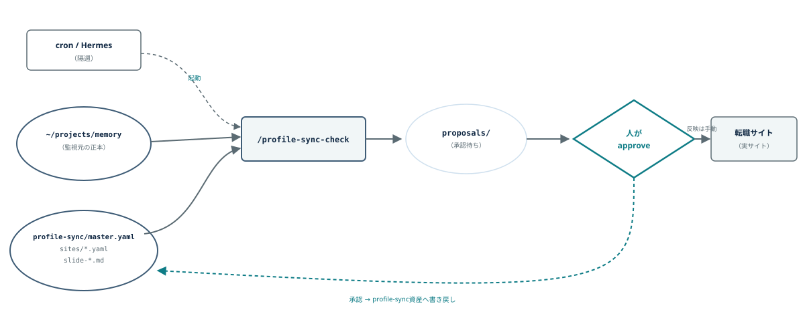
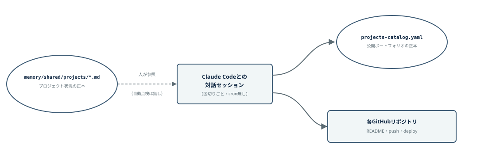

# Architecture

複数のAIアシスタントが同じ正本を参照し、正本の更新は必ず人間の承認を通す。この設計を支える7つの機能を章立てで説明する。

## 全体像

正本(SourceOfTruth)からアシスタント群への「投影」（読み取り）と、変化のsourceから正本への「最適化」（書き込み・承認必須）は別のフローとして分離している。

### A. 投影フロー — SourceOfTruth → Assistant

正本（memory・skills）から Claude Code / claude.ai / Hermes / Cowork への矢印は1本（投影）に単純化。memory側はpost-commit hookとgenスクリプト、skills側はYAML3種＋deliver.pyが実際に投影を動かしている。

### B. 最適化フロー — 変化のsource → SourceOfTruth

書き（変化→正本）は一方向で、必ず承認ゲートを通る。内容ドリフト（memory-review）と構造ドリフト（doc-drift-check）は別々のsourceから出発するが、`proposals/`以降の承認エンジン（`approval_core.py`／`review.py`）は共通。承認後は正本へのgit commitがそのまま監査ログになる。

---

## 1. 記憶正本の投影 ／ スキル正本の投影

正本1箇所を各アシスタント固有の形式に変換して届ける。

**スキルの投影**（詳細）

`assignments.yaml`（誰が何を担当するか＝判断）を`deliver.py`（実際にファイルを書き換える＝実行）が読み、Claude Codeへは`apply`（実書き込み）、Hermes・Coworkへは`show`（読み取り経路の提示）で届ける。判断と実行を分離しているのが設計上の要点。

**記憶の投影**（詳細）

`memory/shared`の`facts・context・projects`は`core.md`（薄い核）に集約されたのち、Claude Codeには`@import`、claude.aiには手動貼付、Hermesには`post-commit hook`経由の生成スクリプトで届く。Hermes向けは文字数上限（1,375字）にぶつかった経緯があり、「全文を載せる」から「薄い核に絞る」へ方針転換した。Cowork向けは手動投影のまま未整備。

## 2. 記憶正本の最適化 ／ スキル正本の最適化

**記憶の最適化**（詳細）

`auto-memory/`・`inbox/`から`memory-review`スキルが起動し、登録簿(`sources.yaml`)を参照しながら`proposals/`を作る。人間が`review.py`で承認すると正本(`memory/shared/`)へ反映され、`post-commit hook`が各投影を再生成する。却下・保留は`proposals/`へ差し戻される。

対話セッション中の人間の指示はその場で承認とみなす（人がdiffを見て黙認・指摘できるため）。`propose→approve`が必須なのは無人実行（cron）のときだけ、と境界を引いている。

スキルの最適化も同じ切り口（登録簿→提案→承認）で個別に運用しているが、対象がスキル定義である点が記憶側と異なる。

## 3. 大規模データ参照（RAG・MCPサーバー化）

会話履歴（PSE）・`~/projects`配下のノート（project-rag）をそれぞれ独立したPostgreSQL + pgvectorに格納し、MCPサーバーとして`search_memory` / `search_projects`等の**読み取り専用ツールのみ**を公開する。`reindex`・`ingest`・`sync`のような書き込み系操作はMCPに出さず、承認ゲート（人間）と同じ「最小権限」の設計思想を貫いている。

## 4. メタデータ最適化（システム資産のメタデータ更新）

各リポジトリのdocsが実装とズレていないかを、直前コミットの差分と`structure-docs.yaml`（監視対象のpath＋hintの一覧）を突き合わせてLLMが判定する。ズレがあれば`proposals/`へ、`eligible-sources.yaml`で許可を確認したうえで`review.py`により人間が承認し、self-describing docsへ反映する。

監視対象を事前にglob宣言する方式はやめ、各docに`path`と`hint`だけを持たせて、実際の判定（差分とhintがズレているか）はLLMに都度任せる設計にした（事前宣言だと大半が重複して二重管理に戻るため）。承認コミット自体が次の検知を誘発する連鎖は未解決の課題として残っている。

内容ドリフト（記憶正本の最適化・週次）とはsourceも登録簿も別だが、`proposals/`以降の承認エンジンは共通。

## 5. 定期情報収集

RSS収集（`info-collector`）は`feeds.yaml`のdomain構成に従ってfetch→選抜・要約→publishし、`info-digest/`（Obsidian・git管理）へ週次ダイジェストとして保存する。正本には直接書き込まない別経路だが、`feeds.yaml`自体は正本（`interests.md`の関心の優先度）から独立してはおらず、`skill-review`が正本の変化を週次点検し、前述「記憶正本の最適化／スキル正本の最適化」と同じ点検→提案→承認を経て反映される（＝スキル正本側の最適化対象）。ダイジェストをブログ化する場合はNotionへ人手で投稿する別フローに続くが、それは本節の収集フローの範囲外。収集そのものは無人実行(cron)を前提とし、正本への直接書き込みは行わない。

## 6. スケジュール更新（バックログ・チェックリストの定期更新）

各プロジェクトのbacklog.md・checklist.mdを、作業の区切りごとに `/update-work-lists` が棚卸しする。完了・決定済みの項目をチェックし、当初リストになかった追加実施タスクを補足し、保留・次フェーズの項目をbacklogへ起票する。人間の承認を挟まず機械的に実行できる範囲（チェック・整形）と、承認が要る範囲（backlogへの新規起票）を分けている。

## 7. ビジネスデータ定期更新（スライド・プロフィール・ポートフォリオ）

キャリア関連のスライド・プロフィール・GitHubポートフォリオも正本からの投影対象として扱うが、自動化の成熟度は一様ではない。

**プロフィール・スライド同期**（自動・隔週）

正本（`memory/shared`配下の実績・プロジェクト状況）の変化を`/profile-sync-check`が隔週で検知し、スライドやプロフィール文面（`profile-sync/master.yaml`・`sites/*.yaml`・自己紹介slide）への未反映分を提案として積む。承認・実サイトへの反映は人が行う。

**ポートフォリオ（GitHubリポジトリ・カタログ）整備**（手動・対話起点）

GitHubリポジトリの整備・README・公開デモは、`projects-catalog.yaml`を正本として対話セッション起点で棚卸しする運用。`projects-catalog.yaml`自体が「ステータスは`memory/shared/projects/*.md`の正本と一致させること」と定めているが、この一致は自動点検されておらず、対話セッション内で人間が都度参照して揃える運用。上の2機能とは異なり、点検→提案→承認を自動で回すスキルはまだ無く、都度Claude Codeとの対話の中で人間が判断・承認しながら進めている（本リポジトリ自体もこの運用で整備された）。
